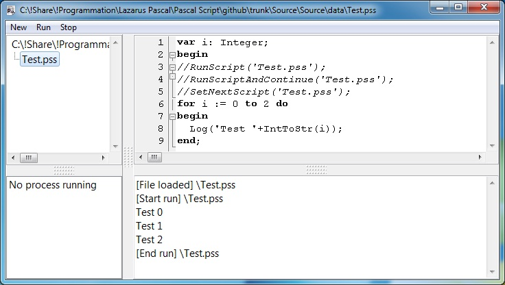

# Pascal-Script-IDE
Pascal Script Compiler ("Multi-Thread" with "Process Manager" and "Script Memory Cache")



## Download
  https://github.com/ddeeproton/Pascal-Script-IDE/raw/master/Source/Source/PascalScriptIDE.exe
  
## Source 
  https://github.com/ddeeproton/Pascal-Script-IDE/raw/master/Source/Versions/Pascal%20Script%20IDE%20Source%20v1.0.zip
  
## Compilator
  https://www.lazarus-ide.org/
  
## Description
Add scripting to your Pascal Application. This program can control your application with Pascal-script. This version is simplified as much as possible, without any librairies added. Ready to be intregrated to your Lazarus Project. 

## How to use

### 1. Add your functions in Unit1.pas
```
procedure SetNextScript(const s: string);
begin
  RunNextScript := s;
end;

procedure Log(const s: string);
begin
  Form1.Memo2.Lines.add(s);
end;

procedure RunScript(const s: string);
begin
  ProcessScript.RunScript(dataPath + '\' + s);
end;

procedure RunScriptAndContinue(const s: string);
begin
  ProcessScript.RunScriptThread(dataPath + '\' + s);
end;
```
### 2. Set your functions in Unit1.pas 
```
procedure TForm1.PSScript1Compile(Sender: TPSScript);
begin
  Sender.AddFunction(@SetNextScript, 'procedure SetNextScript(const s: string)');
  Sender.AddFunction(@Log, 'procedure Log(const s: string)');
  Sender.AddFunction(@RunScript, 'procedure RunScript(const f: String)');
  Sender.AddFunction(@RunScriptAndContinue,'procedure RunScriptAndContinue(const f: String)');
  Sender.AddFunction(@Sleep, 'procedure Sleep(i: Integer)');
end;
```      
### 3. Your functions are ready to be used in your script:


